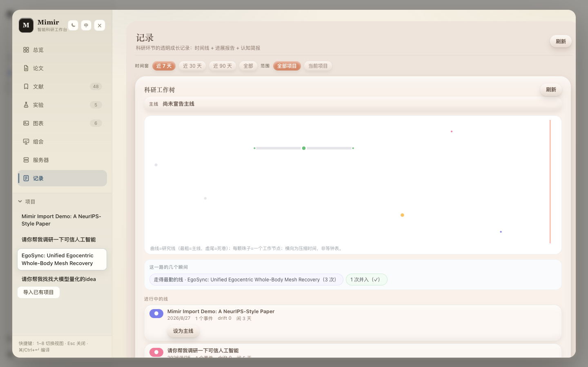

<div align="center">


<h1>Mimir</h1>

<p><strong><a href="https://github.com/deepseek-ai/deepseek-harness">DeepSeek Harness</a> 里的科研生命周期副驾：</strong><br>
文献 · 实验与远程 GPU · 图表 · LaTeX 写作 → 编译 → 预览 · 组会 PPT——一个工作台，由你的 agent 驱动。</p>

<p>
<a href="https://github.com/1692775560/dsh-Mimir-Academic-research/actions/workflows/ci.yml"></a>
<a href="https://www.npmjs.com/package/dsh-mimir"></a>
<a href="https://mimir.smartlarkai.com"></a>
<a href="LICENSE"></a>
</p>

<p><a href="README.md">English</a> · <strong>中文</strong> · <a href="https://mimir.smartlarkai.com">官网</a></p>

</div>

## 这是什么

Mimir 是单个 npm 包（`dsh-mimir`），装进 dsh 即可获得：

- **九视图 Web 工作台**（侧栏开关呼出浮层，深色/浅色、中/EN）：
  **总览** 管线进度与统计 · **论文** Overleaf 式 LaTeX 工作室（编辑 → 编译 → PDF 预览，每条报错可一键让 AI 修） · **文献** arXiv + Web 搜索、AI 相关度评分、全屏 PDF 阅读 · **实验** 指标对比图、一键生成论文图 · **图表** 上传/归纳命名/插入论文 · **组会** 一键生成组会 PPT（论文原图 + 可选 AI 配图） · **服务器** GPU 集群探测 + 远程任务 · **记录** 人本化科研日志——想法演化自动收进 worktree、六视角摘要胶囊、一键进展报告 · **会议** CCF 会议截稿倒计时（ccfddl 目录，按项目关注列表）+ CCF-A 期刊目录——全部视图经 SSE 实时推送，agent/同伴写入即刻上屏，无需手动刷新
- **Agent 工具与斜杠命令**：`/research-idea` `/research-plan` `/research-review` `/paper-write` `/paper-compile`，以及 `arxiv_search`、`web_search`、`wiki_note`、`figure_save`、`latex_compile`、`meeting_deck`、`venue_search`，与远程计算四件套 `server_list` / `server_check` / `server_submit_job` / `server_list_jobs`（与服务器页共享同一批已登记服务器与任务）
- **十一个内置科研技能**（文献综述、novelty 检查、实验规划、引用审计、中英双语去 AI 味润色、rebuttal……），直接教 agent 走流程，零配置

| 总览 | 论文 | 文献 | 实验 |
| --- | --- | --- | --- |
|  |  |  |  |

| 图表 | 组会 | 服务器 | 记录 |
| --- | --- | --- | --- |
|  |  |  |  |

▶ [完整 MP4 演示](https://raw.githubusercontent.com/1692775560/dsh-Mimir-Academic-research/main/docs/media/mimir-demo.mp4)（22 MB）

## 快速上手

前置：Node.js ≥ 22、dsh CLI（`npm install -g @deepseek-ai/dsh`）、agent 会话用的 `DEEPSEEK_API_KEY`。

```sh
dsh plugin --profile web add dsh-mimir@latest   # 安装即自动激活
dsh web                                          # 然后打开 http://127.0.0.1:3080
```

装到了旧版本（比如 0.11.x/0.12.x）？dsh 的插件商店走 pnpm，默认会延迟加载刚发布的新版本。改用精确版本号：`dsh plugin --profile web remove dsh-mimir && dsh plugin --profile web add dsh-mimir@0.14.1`

版本兼容：**0.18.x 需要 dsh ≥ 0.1.2-alpha.4**（上游有破坏性改动）。旧版 dsh 请钉住上一个版本：`dsh plugin --profile web add dsh-mimir@0.16.0`。

点击侧栏底部的 **Mimir**。wiki 存在 `~/.dsh/storages/research_wiki.json`，工件落盘 `./.research`。

可选能力：

- **论文编译**——装一个 LaTeX 引擎（`brew install tectonic` 最省事），或把 `latex.engine` 指到二进制路径
- **Web 搜索**——sxng CLI 已随包安装，一条命令给它一个本地 SearXNG（免 Docker，venv 运行）：
  ```sh
  bash scripts/setup-web-search.sh
  ```
- **Zotero**——在插件配置里填 `zotero.apiKey` / `zotero.userId`（key 在 zotero.org/settings/keys 免费生成）

## 配置

全部为可选项，写在 profile 的 `cordis.patch.yml` 里（完整带注释示例：[examples/mimir-agent/cordis.yml](examples/mimir-agent/cordis.yml)）。

| 键 | 默认值 | 含义 |
| --- | --- | --- |
| `workspaceDir` | `.research` | 研究工作区根目录（工件、备份） |
| `latex.engine` | `auto` | 依次探测 `latexmk` / `tectonic`，或填二进制绝对路径 |
| `search.command` | `auto` | Web 搜索：`auto` 用 PATH 上的 `sxng` 或随包副本 |
| `reviewer.maxRounds` | `3` | 每个项目的评审轮次预算 |
| `backup.enabled` / `intervalMinutes` / `keep` | `true` / `60` / `24` | 定时 wiki 快照 |
| `skills.enabled` | `true` | 注册十一个内置科研技能（含 `research-paper-deai` 去 AI 味） |

## 故障排查

- **找不到插件**——dsh 从 profile 目录解析插件名；用 `dsh plugin --profile web add dsh-mimir@latest` 安装，别在当前目录直接跑。
- **LaTeX 引擎未找到**——`brew install tectonic`，或把 `latex.engine` 指到绝对路径；tectonic 首次编译要联网下载宏包，超时就把 `latex.timeoutMs` 调大。
- **arXiv 失败**——走代理时在启动 dsh 前 export `HTTPS_PROXY`。
- **Web 搜索不可用**——运行 `bash scripts/setup-web-search.sh`（本地 SearXNG），或 `sxng init` 对接自己的实例，然后重启 dsh。

## 更新日志

- **0.18.1**——订阅文件陈旧锁自愈（写进程崩溃不再卡死后续每次检查）+ 会议缓存并发刷新按工作区合并去重，[@mikemikimike](https://github.com/mikemikimike) 贡献（[#144](https://github.com/1692775560/dsh-Mimir-Academic-research/pull/144)，修复 [#141](https://github.com/1692775560/dsh-Mimir-Academic-research/issues/141)）· sxng 集成，[@hkwuks](https://github.com/hkwuks) 贡献（[#137](https://github.com/1692775560/dsh-Mimir-Academic-research/pull/137)）：可选依赖 `sxng-cli` 跟踪 latest、缺 CLI 的报错按你实际用的包管理器给安装命令、新 `/skill-sync` 命令把上游 sxng 技能同步进 dsh 技能目录 · devDependencies 跟踪 dsh 0.1.2-rc.1（已对 0.1.3-alpha.1 验证；peer 下限不变）
- **0.18.0**——功能：**会议**（第九视图）：CCF 会议截稿倒计时（ccfddl 目录）、按项目关注列表、CCF-A 期刊目录、`venue_search` agent 工具 · **SSE 实时推送**：wiki 写入经 `/research/events` 推到打开的面板，所有已打开视图跟随 agent/同伴编辑免刷新 · 侧栏可折叠、大纲栏收窄、按钮紧凑化 · 已核实的架构文档：[docs/architecture.zh.md](docs/architecture.zh.md)（[EN](docs/architecture.md)）。修复：两轮排查共 23 项——路径穿越 / SSH 注入等安全项、文献库脏 id 加载期隔离清洗、SSE 心跳写保护 + 断线重连补偿、切项目时的自动保存/保存通道竞态、订阅检查纳入文件锁、live-refresh 饿死与迟到旧读守卫；controller 生命周期隔离由 [@hkwuks](https://github.com/hkwuks) 贡献（[#129](https://github.com/1692775560/dsh-Mimir-Academic-research/pull/129)）

- **0.17.1**——UI 紧凑化：全部按钮统一降一档（28px / 12px，所有视图共用同一套基础样式）；论文页三栏加最小宽度（源码栏 ≥ 360px），宽度不够时横向滚动，不再压扁源码栏
- **0.17.0**——适配 **dsh 0.1.2-alpha.4**（上游删除 `dsh-client-runtime`，注入改走 `dsh-api-session-controller` + `dsh-client-ui-renderer`；对齐破坏性 API——修复新版 dsh 下 client 类型污染与面板加载失败）。**需要 dsh ≥ 0.1.2-alpha.4；旧版 dsh 请留在 0.16.0。** 同时带来瞬间时间线与 eureka 视图，[@EriXPsy](https://github.com/EriXPsy) 贡献（[#127](https://github.com/1692775560/dsh-Mimir-Academic-research/pull/127)）：五源瞬间候选（爆发 / 休眠后回归 / 跨线汇聚 / 长期搁置 / 里程碑）、canonical-候选-已谢绝时间线、只读 remote
- **0.16.0**——人本化记录视图，[@EriXPsy](https://github.com/EriXPsy) 贡献（[#125](https://github.com/1692775560/dsh-Mimir-Academic-research/pull/125)）：CBE 认知图谱、brief 视图、想法演化 worktree（自动收录）、六视角摘要胶囊；`research-paper-deai` 中英双语去 AI 味技能，[@hkwuks](https://github.com/hkwuks) 贡献（[#126](https://github.com/1692775560/dsh-Mimir-Academic-research/pull/126)，融合 MIT 协议的 aigc-humanizer-zh 与 blader/humanizer，LaTeX 安全且改写后强制编译复核）
- **0.15.1**——取消 `web_search` 时终止 sxng 子进程（不再泄漏僵尸进程），[@hxhy](https://github.com/huixiaheyu) 贡献（[#124](https://github.com/1692775560/dsh-Mimir-Academic-research/pull/124)）
- **0.15.0**——SearXNG Web 搜索增强，[@hkwuks](https://github.com/hkwuks) 贡献（[#122](https://github.com/1692775560/dsh-Mimir-Academic-research/pull/122)）：sxng-cli 配置面板（SxngConfig）、Agent 搜索经 sxng skill 引导；本地 LaTeX 项目导入，[@1692775560](https://github.com/1692775560) 贡献；自然语言项目参数 + PDF 全屏弹窗，[@Nick](https://github.com/Nick) 贡献（[#120](https://github.com/1692775560/dsh-Mimir-Academic-research/pull/120)）
- **0.14.0**——SearXNG Web 搜索，[@hkwuks](https://github.com/hkwuks) 贡献（[#114](https://github.com/1692775560/dsh-Mimir-Academic-research/pull/114)）：`web_search` 工具 + Library Web 搜索源；sxng-cli 随包 + 一键 SearXNG 脚本
- **0.13.0**——组会 PPT 支持论文原图逐图页、`meeting_deck` agent 工具、集成 academic-Group-meeting-skills 流水线
- **0.12.0**——组会视图（一键组会 PPT）、`research-meeting-deck` 技能
- **0.11.0**——单包安装：工作台直接随 `dsh-mimir` 发布
- **0.10.0**——会议模板（CVPR/NeurIPS/ACL/IEEE/ACM……）、自定义模板上传、按会议排版
- **0.9.0**——文献按项目隔离、AI 相关度评分、图重命名/caption + `figure_organize`、全屏 PDF 阅读
- **0.8.x**——内置科研技能；订阅与项目列表可折叠
- **0.7.0**——Zotero 集成；Linear 风格视觉改版
- **更早**——arXiv 订阅、论文快照（diff/回退）、指标一键生成论文图、related work 草稿、远程任务回写

## 参与贡献

从 `main` 拉分支（`feature/<name>` / `fix/<name>`），保持 `pnpm run build && pnpm test && pnpm run typecheck` 全绿，提 PR——见 [CONTRIBUTING.zh.md](CONTRIBUTING.zh.md)。合并 PR 请用 **merge commit**（不要 squash），这样贡献者署名才能进入 contributors 图表。想看全貌，先读已核实的架构文档：[docs/architecture.zh.md](docs/architecture.zh.md)（[EN](docs/architecture.md)）。

现有贡献者：[@EriXPsy](https://github.com/EriXPsy)（记录视图、人本化日志）· [@hkwuks](https://github.com/hkwuks)（SearXNG Web 搜索、[sxng CLI](https://github.com/hkwuks/sxng-cli)、去 AI 味技能）· [@hxhy](https://github.com/huixiaheyu)（web_search 取消修复）

## 交流群

有问题、想法或想围观开发进度，欢迎扫码进微信群。群二维码 7 天过期一次，如果过期了，加 Nick 拉你进群：

<p>
  
  &nbsp;&nbsp;
  
</p>
<p><sub>左：交流群 · 右：Nick（维护者）——群码过期时的兜底入口</sub></p>

## 赞赏

如果 Mimir 帮到了你，可以请开发者喝杯咖啡——每一分都会变成这个项目的维护时间：


## 致谢

- 工作流灵感：[ARIS / Auto-claude-code-research-in-sleep](https://github.com/wanshuiyin/Auto-claude-code-research-in-sleep)
- 构建于 [DeepSeek Harness](https://github.com/deepseek-ai/deepseek-harness) 插件平台

## License

[MIT](LICENSE)
