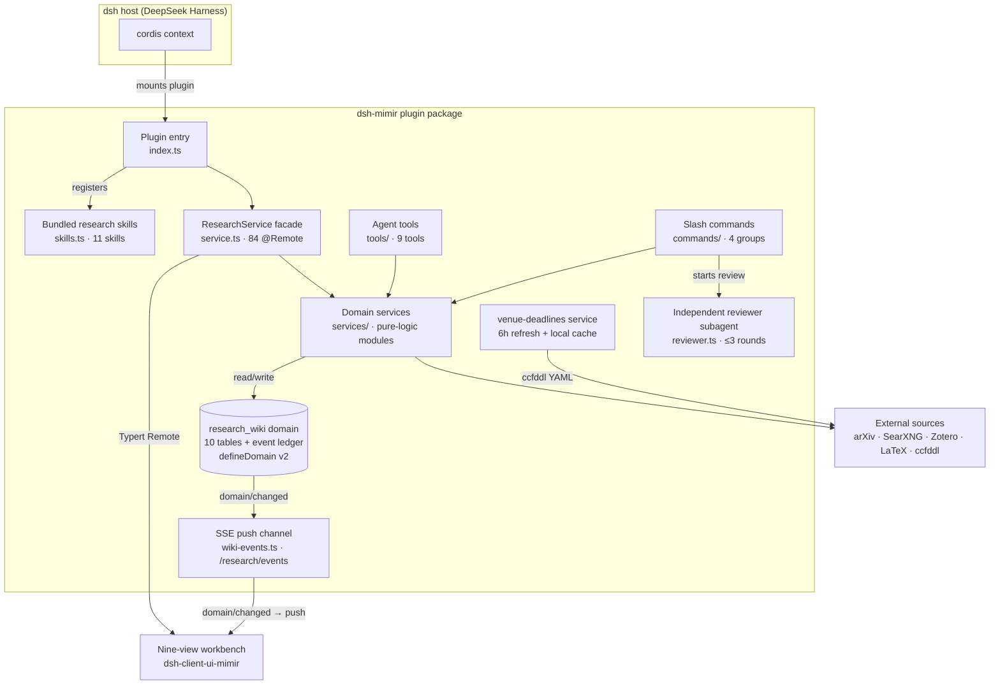

# Mimir Architecture

English | [中文](architecture.zh.md)

Current as of v0.18.0. Numbers in this document are verified against the
code — if you change one, update it here.

## Overview

## Layers

**Entry (`index.ts`)** — mounts the plugin into the host's cordis context:
registers the skills, wires the domain, exposes the HTTP routes
(`/research/*`, including `/research/events`), and owns the plugin lifecycle
(startup quarantine, timers, dispose).

**Facade (`service.ts`)** — 84 `@Remote` methods and nothing else. All
logic lives behind it in the domain services; the facade validates inputs,
delegates, and translates results. The browser client reaches it through
the generated Typert remote face.

**Domain services (`services/`)** — one module per concern (library, paper
source, snapshots, bibliography, meeting decks, servers/jobs, venue
deadlines, backup, …). Business rules live in pure, DOM-free modules at
`src/*.ts`; services are thin shells doing I/O, timers, and locking. This
split is what makes the logic unit-testable (see CODE_STYLE.md §1).

**Storage (`store.ts`)** — a single `research_wiki` domain, pinned at
version 2, with 10 tables: `papers`, `ideas`, `claims`, `projects`,
`experiments`, `servers`, `jobs`, `figures`, `events`, `venue_watches`.
Additive-only changes: optional fields with `.default(...)`, new tables
open empty on old snapshots. `events` is the append-only ledger that powers
the ledger view and the cognitive engine.

## HTTP route permission model

The `/research/*` routes split in two (`http-write-boundary.ts`, #210).
**Write routes** (figure upload, template upload) require an `Origin` header
matching `Host` exactly (`isSameOriginWrite`). **Read/download routes**
(compiled PDF, paper PDF, figure, meeting deck, SSE events) are
loopback-panel-only (`isTrustedRead`): the `Host` header must name the
loopback listener (`localhost`/`127.0.0.1`/`[::1]`, any port), and an
`Origin`, when present (cross-origin fetches always carry one), must match
it exactly. The panel's ``/`<iframe>`/`<a>` navigations carry no
`Origin` and pass on the Host check alone. Under DNS rebinding the rebound
request carries the attacker's host name and is refused. Deployment
boundary: when dsh is exposed through a reverse proxy or LAN bind, these
routes stay loopback-only by design; expose them remotely only behind an
authenticating proxy that rewrites `Host`.

## Agent surface

- **Tools (9)**: `arxiv_search`, `web_search`, `wiki_note`, `figure_save`,
  `latex_compile`, `zotero_*`, `venue_search`, … — the agent's hands.
- **Slash commands (4 groups)**: research-idea / plan / review / paper
  writing & compile.
- **Skills (11)**: pipeline, lit-review, novelty-check, experiment-plan,
  result-to-claim, paper-drafting, citation-audit, rebuttal, figure-plan,
  paper-deai, meeting-deck — workflow playbooks registered at runtime rank
  250 so project-level skills can override.
- **Reviewer subagent**: independent context, up to 3 PASS/WARN/FAIL rounds.

## Client channels

The workbench (`dsh-client-ui-mimir`, nine views: overview / paper /
literature / experiments / figures / meetings / servers / ledger / venues)
talks to the host over two channels:

1. **Typert Remote** (request/response) — every interaction.
2. **SSE push** (`/research/events`) — the host's storage layer emits
   `domain/changed` on every write; `wiki-events.ts` fans it out to
   connected panels, which debounce (400ms, 2s max-wait) and re-read only
   the affected slices. Reconnect triggers a full warm-slice resync. This
   is what keeps the panel live while the agent works in the background.

## External integrations

arXiv (search + PDF cache), SearXNG (web search via sxng CLI), Zotero
(library import), LaTeX engines (latexmk/tectonic, auto-detected),
ccfddl/ccf-deadlines (venue catalog, cached 6h, offline-tolerant).

## Invariants

The load-bearing rules — wiki v2 additive-only, generation+pending async
guards, path-whitelist validation, CSS variable fallbacks — are documented
with their reasons in [CODE_STYLE.md](../CODE_STYLE.md) §3–§5.
