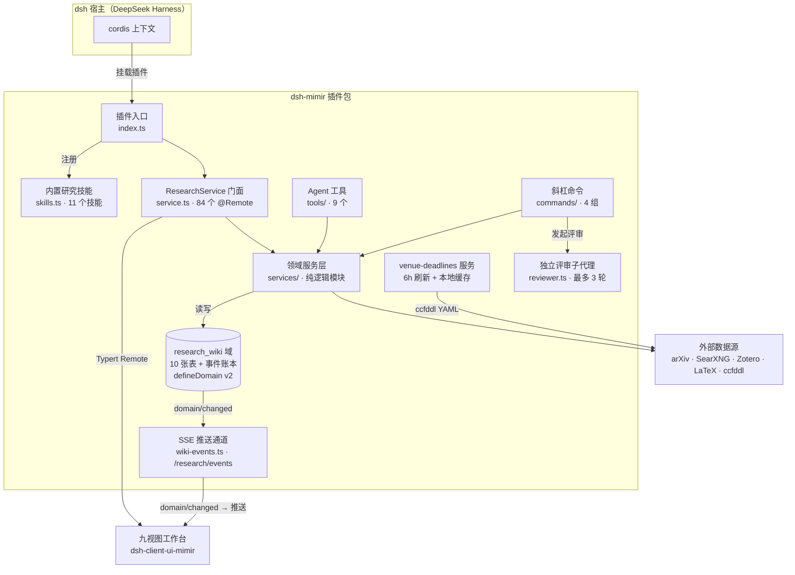

# Mimir 架构

[English](architecture.md) | 中文

对应 v0.18.0。本文档里的数字都与代码核实过——改了代码请同步改这里。

## 总览

## 分层

**入口（`index.ts`）**——把插件挂进宿主的 cordis 上下文：注册技能、接线存储域、
暴露 HTTP 路由（`/research/*`，含 `/research/events`），持有插件生命周期
（启动清洗、定时器、dispose）。

**门面（`service.ts`）**——84 个 `@Remote` 方法，仅此而已。所有逻辑都在它身后的
领域服务里；门面只做入参校验、委派、结果转译。浏览器客户端通过生成的 Typert
remote face 调用它。

**领域服务（`services/`）**——一个模块管一件事（文献库、论文源码、快照、参考文献、
组会 deck、服务器/任务、会议 DDL、备份……）。业务规则住在 `src/*.ts` 的纯模块里
（无 DOM、无副作用）；服务是薄薄的壳，只做 I/O、定时器、锁。这个分离让逻辑可以
单测（见 CODE_STYLE.zh.md §1）。

**存储（`store.ts`）**——单一 `research_wiki` 域，钉在 version 2，共 10 张表：
`papers`、`ideas`、`claims`、`projects`、`experiments`、`servers`、`jobs`、
`figures`、`events`、`venue_watches`。只许增量变更：可选字段带 `.default(...)`，
新表对旧快照空开。`events` 是只追加的账本，驱动记录视图和认知引擎。

## HTTP 路由权限模型

`/research/*` 路由分两类（`http-write-boundary.ts`，#210）。**写路由**（图上传、
模板上传）要求 `Origin` 头与 `Host` 精确同源（`isSameOriginWrite`）。**读/下载
路由**（编译 PDF、论文 PDF、图、组会 deck、SSE events）只对 loopback 面板开放
（`isTrustedRead`）：`Host` 必须指向 loopback 监听（`localhost`/`127.0.0.1`/
`[::1]`，任意端口）；若带 `Origin`（跨源 fetch 必带）则必须与 `Host` 精确一致。
面板的 ``/`<iframe>`/`<a>` 导航不带 `Origin`，仅靠 Host 校验即可通过。
DNS rebinding 下反弹请求带的是攻击者域名，天然被拒。部署边界：dsh 经反代或
LAN 暴露时这些路由仍按设计只认 loopback，远程暴露只能放在会改写 `Host` 的
认证代理之后。

## Agent 能力面

- **工具（9 个）**：`arxiv_search`、`web_search`、`wiki_note`、`figure_save`、
  `latex_compile`、`zotero_*`、`venue_search`……agent 的手。
- **斜杠命令（4 组）**：选题 / 方案 / 评审 / 论文写作与编译。
- **技能（11 个）**：pipeline、lit-review、novelty-check、experiment-plan、
  result-to-claim、paper-drafting、citation-audit、rebuttal、figure-plan、
  paper-deai、meeting-deck——以运行时 rank 250 注册，项目级同名技能可覆盖。
- **独立评审子代理**：全新上下文运行，最多 3 轮 PASS/WARN/FAIL。

## 客户端通道

工作台（`dsh-client-ui-mimir`，九个视图：总览/论文/文献/实验/图表/组会/服务器/
记录/会议）通过两条通道与宿主通信：

1. **Typert Remote**（请求/响应）——所有交互。
2. **SSE 推送**（`/research/events`）——宿主存储层每次写入都发 `domain/changed`
   事件；`wiki-events.ts` 扇出给所有连接的面板，面板防抖聚合（400ms，2s 上限）
   后只重读受影响的板块。断线重连会对当前视图全量补偿。这让 agent 在后台工作时
   面板保持实时。

## 外部集成

arXiv（检索 + PDF 缓存）、SearXNG（经 sxng CLI 的 web 搜索）、Zotero（文献库导入）、
LaTeX 引擎（latexmk/tectonic 自动探测）、ccfddl/ccf-deadlines（会议目录，6 小时
缓存，离线容错）。

## 不变量

承重的几条规则——wiki v2 只许增量、generation+pending 异步守卫、路径白名单校验、
CSS 变量兜底——连同原因写在 [CODE_STYLE.zh.md](../CODE_STYLE.zh.md) §3–§5。
